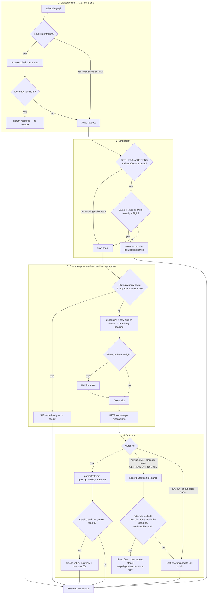
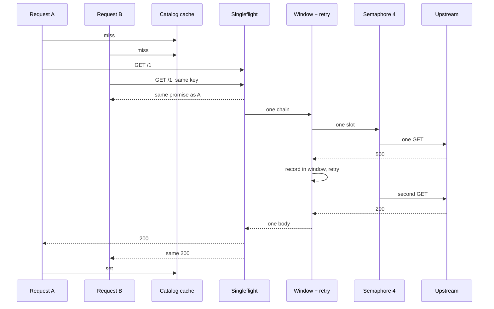

# Senior Software Architect — Technical Exercise

Welcome. This exercise is part of the interview process for the [Senior Software Architect](https://careers.tether.io/o/senior-software-architect-100-remote-worldwide) role.

The goal is **not** to see if you can build a CRUD service, it's to see how you reason about service boundaries, contracts, failure modes, deployment topology, and operability. The written sections of this README are weighted at least as heavily as the code.

> **Time budget:** target 4-6 hours of focused work.

---

## Table of Contents

1. [The Brief](#1-the-brief)
2. [What You Will Build](#2-what-you-will-build)
    - [2.1 Upstream contracts](#21-upstream-contracts)
3. [Functional Requirements](#3-functional-requirements)
    - [3.1 Hydration & timezone projection](#31-hydration--timezone-projection)
    - [3.2 Conflict detection](#32-conflict-detection)
4. [Constraints & Ground Rules](#4-constraints--ground-rules)
5. [Deliverables](#5-deliverables)
6. [Candidate Sections to Fill In](#6-candidate-sections-to-fill-in)
    - [6.0 Development](#60-development)
    - [6.1 Architecture Overview](#61-architecture-overview)
    - [6.2 Service Boundaries & Contracts](#62-service-boundaries--contracts)
    - [6.3 Data Model & Consistency](#63-data-model--consistency)
    - [6.4 Failure Modes & Status-Code Strategy](#64-failure-modes--status-code-strategy)
    - [6.5 Validation Strategy](#65-validation-strategy)
    - [6.6 Testing Strategy](#66-testing-strategy)
    - [6.7 Observability](#67-observability)
    - [6.8 Security](#68-security)
    - [6.9 Scaling & Performance](#69-scaling--performance)
    - [6.10 Deployment](#610-deployment)
    - [6.11 Trade-offs & What You Would Do Next](#611-trade-offs--what-you-would-do-next)
    - [6.12 Other Notables](#612-other-notables)

---

## 1. The Brief

There are various internal services, two of which need to be integrated with and cannot be change:

- **`catalog`** — an HTTP service that stores resource metadata. Each resource has a numeric `id`, a `name`, a `kind` (e.g. `"room"`, `"gpu"`, `"vehicle"`), a `capacity`, and an IANA `timezone` (e.g. `"Europe/Lisbon"`).
- **`reservations`** — an HTTP service that stores reservations against those resources. Each reservation has a numeric `id`, a `resourceId`, a `holder` (opaque string), an ISO-8601 UTC `startsAt` and `endsAt`.

Both upstream services are minimal mock HTTP servers — small Node `http` servers, no framework, no auth, no retries built in. Treat them as black-boxes: they may go down, slow down, return 4xx/5xx, or occasionally return malformed payloads.

Design and implement a third service — the **`scheduling-api`** — that sits in front of these two services and exposes a clean, opinionated, well-behaved HTTP API to its consumers.

## 2. What You Will Build

```
                       ┌─────────────────────┐
   client ───HTTP──▶   │    scheduling-api   │  ◀── you build this
                       └────────┬────────────┘
                                │
                ┌───────────────┴────────────────┐
                ▼                                ▼
       ┌──────────────────┐            ┌───────────────────┐
       │     catalog      │            │   reservations    │
       └──────────────────┘            └───────────────────┘
            (given)                          (given)
```

**Given.** The two upstream mock services are provided, fully formed, as [`catalog-service.js`](./catalog-service.js) and [`reservations-service.js`](./reservations-service.js) at the repo root. They are zero-dependency Node `http` servers. You will not modify them — they represent third-party systems your `scheduling-api` integrates with. Their contracts and the deterministic failure-mode fixtures baked into them are documented in [§2.1](#21-upstream-contracts).

**Deliverable.** The `scheduling-api` service that consumes the upstreams, exposes the capabilities in [§3](#3-functional-requirements), and accepts writes that create, modify and cancel reservations.

### 2.1 Upstream contracts

Both upstreams listen on the port supplied by the `PORT` environment variable. Defaults: `catalog` 4040, `reservations` 5050.

#### `catalog`

- `GET /{id}` → `200 { id, name, kind, capacity, timezone }` | `404` if unknown | `400` for a non-numeric path | `405` for any non-GET method.

#### `reservations`

- `GET /{id}` → `200 { id, resourceId, holder, startsAt, endsAt }` | `404`.
- `GET /?resourceId={id}` → `200 [...]` — list, optionally filtered by `resourceId`. **No pagination.**
- `POST /` → `201 {...}` — id assigned by the service; body is echoed back.
- `PUT /{id}` → `200 {...}` — full replace.
- `PATCH /{id}` → `200 {...}` | `404`.
- `DELETE /{id}` → `204` | `404`.

The reservations service performs **no** validation, **no** conflict detection, and **no** authorisation — it will gladly persist overlapping or nonsensical records. It may also experience internal server errors, truncated JSON and slow responses. The `scheduling-api` must handle these concerns and failure modes.

## 3. Functional Requirements

The `scheduling-api` MUST expose HTTP capabilities for the operations listed below. **The URI scheme, HTTP methods, status-code policy, content negotiation, pagination scheme, filter syntax and error-body shape are architectural decisions you own** — document them in [§6.2](#62-service-boundaries--contracts) and justify the contentious ones in [§6.4](#64-failure-modes--status-code-strategy). The list below is the contract of *what must be possible*, not *how it must look on the wire*.

### Reservation lifecycle

- **Read a single reservation** in hydrated form (see [§3.1](#31-hydration--timezone-projection)).
- **List reservations** in hydrated form, supporting at minimum: pagination, filter by `resourceId`, and filter by overlap with a caller-supplied time window. Further filters are at your discretion.
- **Create a reservation.** Validate the body. Reject conflicts (see [§3.2](#32-conflict-detection)). The created reservation must be addressable by a subsequent read.
- **Replace a reservation in full.** Idempotent. Subject to the same conflict rule as create.
- **Apply a partial change to a reservation** — typically a time shift or holder change. Behavior under retries must be specified.
- **Cancel a reservation.**

### Aggregation

- **Resource utilisation summary** — given a resource and a caller-supplied window (`from`, `to`), return the resource together with an aggregated view of utilisation across the reservations in that window. Choose the metrics you can defend (e.g. total reserved minutes, count of distinct holders, peak concurrency).

### Operational

- **Liveness probe** — cheap, in-process only. Does not touch upstreams. Tells the orchestrator whether to restart the process.
- **Readiness probe** — reflects the state of upstream dependencies. Tells the load balancer whether to route traffic. What counts as "ready" is your call — discuss in [§6.10](#610-deployment).

### 3.1 Hydration & timezone projection

A **hydrated reservation** is the reservation joined with its resource's identifying metadata and projected into the resource's local timezone. At minimum it must surface: the reservation's identity, its resource (or enough of the resource for a consumer to act on it), the holder, the start and end as UTC instants, the equivalent local-time projection, and the duration. An illustrative shape — **not** a required shape — is:

```json
{
  "id": 42,
  "resourceId": 1,
  "resource": { "name": "Conference Room A", "kind": "room", "capacity": 8, "timezone": "Europe/Lisbon" },
  "holder": "alice@example.com",
  "startsAt": "2026-06-01T09:00:00Z",
  "endsAt":   "2026-06-01T10:00:00Z",
  "localStartsAt": "2026-06-01T10:00:00+01:00",
  "localEndsAt":   "2026-06-01T11:00:00+01:00",
  "durationMinutes": 60
}
```


### 3.2 Conflict detection

Create and full-replace must reject reservations whose window overlaps an existing reservation for the same `resourceId`. Define the exact semantics (inclusive vs. exclusive endpoints, what "overlap" means for back-to-back windows) and document them in [§6.2](#62-service-boundaries--contracts). Surface conflicts in a way that a client can act on programmatically.

## 4. Constraints & Ground Rules

- Use any open-source libraries but be sure that the sources used are credible. 
- Do not modify the contracts of the upstream services
- Do not rely on an external database. Process state may be ephemeral for purposes of the exercise POC. However, design discussion in [§6.3](#63-data-model--consistency) must treat persistence as if it were real.
- AI-assistance is permitted but offloading any issues found as overlooked AI mistakes is indefensible. Every design decision will be discussed in the follow-up. Be ready to defend the design as submitted.

## 5. Deliverables

1. The code, runnable per [§6.0](#60-development) and deployable per [§6.10](#610-deployment).
2. This README, with every section under [§6](#6-candidate-sections-to-fill-in) filled in. Replace each `<TODO …>` block with your answer.

---

## 6. Candidate Sections to Fill In

> Replace every `<TODO …>` placeholder. Do **not** delete the headings — we use them as a rubric.

### 6.0 Development

Requires Node.js 24 (`.nvmrc`) and npm.

```bash
cp .env.sample .env.development   # NODE_ENV defaults to development
npm install

# three processes — upstreams are unmodified CJS mocks
npm run start:catalog        # :4040
npm run start:reservations   # :5050
npm run start:dev            # scheduling-api :3000
```

`catalog-service.js` / `reservations-service.js` are the given CommonJS mocks. The Nest app compiles to CommonJS via SWC (`nodenext` without `"type": "module"`), so relative imports have no `.js` suffix.

Same three processes via Compose (API image is distroless; mocks stay the given `.js` files, unmodified):

```bash
docker compose up --build
```

| Command | Purpose |
| --- | --- |
| `npm run start:dev` | Nest watch mode |
| `npm test` | Jest, `NODE_ENV=test`, `--runInBand` |
| `npm run test:unit` / `test:e2e` | `*.unit.spec.ts` / `*.e2e.spec.ts` |
| `npm run lint` | ESLint + Prettier via lint-staged/Husky |
| `npm run build` | `nest build` (SWC) → `dist/` |
| `npm run start:prod` | `node dist/main` |
| `docker compose up --build` | catalog :4040, reservations :5050, scheduling-api :3000 |

Open [http://127.0.0.1:3000/swagger](http://127.0.0.1:3000/swagger) (`GET /` 301s there). Local `npm` loads `.env.${NODE_ENV}` (copy `.env.sample`). The API image does not ship dotenv files; Compose injects process env. Full key list: `.env.sample`. Probes and rolls: §6.10.

Current public surface: `POST /reservations`, `PUT /reservations/:id`, `PATCH /reservations/:id`, `DELETE /reservations/:id`, `GET /reservations`, `GET /reservations/:id`, `GET /resources/:id/utilisation`, `GET /health/liveness`, `GET /health/readiness`, `GET /metrics`, Swagger.

### 6.1 Architecture Overview

`scheduling-api` is a NestJS 12 HTTP facade in front of two black-box REST services. Framework choice: typed modules, `ValidationPipe`, Terminus, Swagger, and Axios interceptors in one place — appropriate for a BFF that owns validation, hydration, and failure mapping.

Catalog and reservations are ordinary REST (`GET /{id}` → JSON). Each outbound client imports `UpstreamHttpModule.register(...)`: one Axios instance with the hop in the diagrams below (retry, deadline, sliding window, singleflight, concurrency cap). Axios helpers live in `src/common/http/helpers.ts`. That is the anti-corruption layer.

Runtime topology (local / POC):

```
client → scheduling-api :3000
            ├─ catalog      :4040   (axios, retry + deadline + sliding window + singleflight + concurrency cap)
            └─ reservations :5050   (same, no catalog cache)
```

Health pings use a separate Axios client and never enter this stack. A catalog `GET /{id}` is the four stages below; reservations skip stage 1 (no cache).



The flowchart is one caller. Two concurrent misses of the same catalog id collapse to one chain, one semaphore slot, a shared retry, then a single cache `set`:



That stack sits on the two business Axios clients. The rest of the process is a module split: `CatalogModule` / `ReservationsModule` own the upstream clients and write confirmation (list/GET after an uncertain mutating call). `SchedulingModule` owns the public API, hydration, overlap, mutex, and `Idempotency-Key`. `HealthModule` owns probes on a **dedicated** Axios client (no retry, no sliding window, no semaphore — so a saturated business window does not flap readiness, and liveness never depends on catalog). `MetricsModule` is scrape-only (`GET /metrics`). That keeps the untrusted-upstream boundary off the HTTP controllers.

**Concurrency.** One Node process, async I/O. A hydrated read is sequential: reservation first (need `resourceId`), then catalog. Idempotent Axios GET/HEAD coalesce as in the sequence: method + URI share one in-flight request **and its retry chain**. After it settles, the next GET is live again. Two hydrations of different reservations on the same `resourceId` therefore share one catalog hop and one of the four semaphore slots.

**Writes.** Create/replace/patch/cancel serialize per involved `resourceId` inside the process (`KeyedMutex`, two keys in ascending order when a patch/replace moves resources). Concurrent mutations on different resources proceed in parallel. Across replicas there is no distributed lock — see §6.3.

**Backpressure / limits.** Stage 3 caps each Axios attempt by the remaining retry **deadline** (default 2s). Idempotent GET/HEAD retry on 5xx, network errors, and timeouts; POST/PUT/PATCH/DELETE are a single attempt. The sliding window fail-fasts with 503 when the upstream looks down. Malformed bodies and 4xx complete in one attempt and stay out of the window (stage 4). The concurrency cap is per upstream process, independent of retry/window.

### 6.2 Service Boundaries & Contracts

**Ownership.** Catalog and reservations are third-party REST services. `scheduling-api` owns the consumer contract: hydration, timezone projection, conflict rules, and HTTP status mapping.

**Public HTTP (current):**

| Method | Path | Meaning |
| --- | --- | --- |
| `POST` | `/reservations` | Create. Body: `{ resourceId, holder, startsAt, endsAt }`. Optional header `Idempotency-Key`. **201** hydrated. |
| `PUT` | `/reservations/:id` | Full replace. Same body as create. Optional `Idempotency-Key`. **200** hydrated. Missing id → **404** (we GET first; upstream PUT is an upsert and is not used as one). |
| `PATCH` | `/reservations/:id` | Partial change. Body may omit fields. Overlap is **not** checked (only create and full-replace, §3.2). Optional `Idempotency-Key`. **200** hydrated. |
| `DELETE` | `/reservations/:id` | Cancel. **204**, including when the id is already gone (idempotent). |
| `GET` | `/reservations` | Hydrated list. Query: `skip`/`take` (defaults 0/10, max take 100), optional `resourceId`, optional overlap window `from`/`to` (ISO-8601, half-open, both required together). Body: `{ rows, count }`. |
| `GET` | `/reservations/:id` | Hydrated reservation (§3.1). `:id` is a positive integer (`IdParamDto` → 400). |
| `GET` | `/resources/:id/utilisation` | Resource utilisation for required `from`/`to` (half-open). **200** with resource + metrics. Missing resource → **404**. |
| `GET` | `/health/liveness` | Process up, no upstream I/O. **200**. Orchestrator restart probe — not Compose routing. |
| `GET` | `/health/readiness` | Terminus ping of `GET /` on catalog and reservations via the dedicated health client. Status **< 500** is up (catalog mock `/` → **400**; empty store **404**/**200** is also up). **200** / **503**. LB drain probe. Ownership of the three health consumers is in §6.10. |
| `GET` | `/metrics` | Prometheus text. `upstream_request_duration_seconds` (per attempt), `upstream_retries_total`, `upstream_circuit_open`, `http_requests_total` by method/status. Scrape, `/health`, `/swagger`, and `/` are not counted in `http_requests_total`. Unauthenticated in the POC. |
| `GET` | `/` | 301 → `/swagger` |
| `GET` | `/swagger` | OpenAPI UI |

Hydrated body matches the illustrative shape in §3.1 (`resource` without nested `id`, UTC + local ISO-8601, `durationMinutes`). List is the same objects inside `{ rows, count }`. `count` is the total after filters, before `skip`/`take`. Create/replace/patch return that same object.

Windows are half-open `[startsAt, endsAt)`. Two intervals overlap iff each starts before the other ends; back-to-back is allowed. List `from`/`to`, utilisation, create, and replace use that rule. Replace excludes the row's own `id` from the overlap set. PATCH does not conflict-check.

Utilisation is a derived read: catalog `GET /{id}` plus reservations `GET /?resourceId=`, then clip each overlapping reservation to `[from, to)`. **`bookedMinutes`** is the sum of those clipped lengths (overlaps add). **`busyMinutes`** is the union. **`utilisation`** is `busyMinutes / windowMinutes`. **`peakConcurrency`** is a sweep line (back-to-back stays 1). **`distinctHolders`** / **`reservationCount`** count rows that overlap the window. No process store: the journal is the source of truth.

**Write flow.** Validate `endsAt > startsAt` (on the body for create/replace, on the merged view for patch). Replay `Idempotency-Key` when the fingerprint matches. For replace/patch/cancel, GET the row to choose lock keys, take the locks, then **GET again** and use that snapshot for merge, overlap (replace only), and identity-skip (if `resourceId` moved, drop the locks and retry). Cancel's first GET 404 is already **204** (no lock). Lock involved `resourceId`s. Load catalog (`404` → **400** `RESOURCE_NOT_FOUND`; 5xx/timeout/malformed → **502** `{ message: "Catalog resource could not be loaded", code }`). Create and replace list that resource. Create: an existing natural key `(resourceId, holder, startsAt, endsAt)` is **201** without a second POST; any other overlap → **409** `{ code: "OVERLAP", conflicts: [{ id, startsAt, endsAt }] }`. Replace: same overlap rule excluding self. PATCH skips overlap (§3.2). Mutating HTTP **once**. Uncertain create → list + natural key; uncertain replace/patch → `GET /{id}`; found matching intent → success, else **504**. Uncertain cancel → `GET /{id}`: 404 → **204**, still present → **504**. Hydration uses the catalog row already in hand.

**Error bodies.** Two envelopes. Discriminator: `Array.isArray(message)`. `HttpExceptionFilter` passes Nest `HttpException` wrappers through and wraps anything else.

Application errors — thrown in our code (`HttpException`), including Axios mapping in the filter:

```ts
interface IHttpError {
  statusCode: number;
  error: string;   // HTTP reason phrase, e.g. "Bad Gateway"
  message: string;
  code?: string;   // present when the client should branch
}
```

`code` values today: `CATALOG_UNAVAILABLE` | `CATALOG_NOT_FOUND` | `MALFORMED_PAYLOAD` | `RESOURCE_NOT_FOUND` | `OVERLAP` | `IDEMPOTENCY_KEY_REUSE` | `PAGE_NOT_FOUND` | `INTERNAL_SERVER_ERROR`. `OVERLAP` also carries `conflicts: { id, startsAt, endsAt }[]`. Mapped upstream failures without a tighter reason omit `code` (`Upstream error`, `Upstream timeout`, `Not Found`). Unknown routes: Nest's default `Cannot GET …` is rewritten to **404** `{ code: "PAGE_NOT_FOUND" }`. Unhandled exceptions become **500** `{ code: "INTERNAL_SERVER_ERROR" }`.

DTO validation — `HttpValidationPipe` passes class-validator `ValidationError[]` through as the Nest `BadRequestException` body (`property` / `constraints` / nested `children`). A merged window after PATCH is the same `EndsAfterStartConstraint` on `PatchReservationDto` (both dates present after merge); the service runs it through `HttpValidationPipe`, not a hand-built error.

```ts
interface IValidationError {
  statusCode: 400;
  error: "Bad Request";
  message: Array<{
    property: string;
    constraints?: Record<string, string>;  // constraint name → message
    children?: /* same shape, nested DTOs */;
  }>;
}
```

Status mapping (when 404 vs 502 vs 504, retries, uncertain POST) is in §6.4. Health probe JSON is Terminus's own shape (`status` / `info` / `error`), not these envelopes: liveness **200**, readiness **200** or **503**.

**Production.** A single scheduling facade is the right bounded context. Conflict detection belongs here, on top of the given reservations store. Utilisation is the same: a query over that journal, not a time series we persist.

### 6.3 Data Model & Consistency

**POC.** Process state is ephemeral; source of truth is catalog and reservations. Scheduling-api holds a derived hydrated view, an in-process catalog success-cache, an in-process `Idempotency-Key` map, and a per-`resourceId` mutex.

**Entities (logical):**

- Resource: `id, name, kind, capacity, timezone` (catalog).
- Reservation: `id, resourceId, holder, startsAt, endsAt` (UTC, reservations).
- Hydrated reservation: derived join + date-fns projection into the resource IANA zone.
- Resource utilisation: derived from catalog + reservations in a caller window (no extra store).

**Invariants:** `endsAt > startsAt`; `resourceId` exists in catalog at write time; create and full-replace reject overlapping windows on the same `resourceId` (half-open `[start, end)` as in §6.2). PATCH does not enforce that overlap rule. The natural key `(resourceId, holder, startsAt, endsAt)` is how an uncertain create is reconciled against the journal.

**Production persistence.** Reservations is the system of record. Scheduling-api stays a derived layer. Catalog is a small read-only reference set: an in-process cache of successful GET-by-id is the fit (see §6.9). Idempotency keys belong next to that SoT once durable storage exists.

**Outbox vs no external database.** A transactional outbox is the production shape for a write this service owns: persist the accepted intent and the outbound `POST` in one commit, then a worker delivers to reservations until ack. §4 forbids an external database for the POC, so that table is not here. That is the trade-off, not a claim that outbox is the wrong pattern. An in-memory outbox would acknowledge a write the process can lose, then apply it after the client already received 5xx — weaker than **504** plus a client retry with `Idempotency-Key`. Reservations already *is* the journal; the substitute is read-back after a single POST (GET is retried; POST is not). When a database is allowed, outbox (and durable idempotency keys) close the restart gap that process memory cannot: crash between a successful POST and remembering the key, and two replicas racing without a distributed lock.

**Staleness.** Every successful read is live against both upstreams (catalog may lag by its TTL). A confirmed create followed by `GET /reservations/:id` observes the write when the upstream GET succeeds. A process restart or rolling deploy drops the catalog cache, the idempotency map, and the mutexes — the journal is still the SoT; clients retry with `Idempotency-Key` as in §6.4.

### 6.4 Failure Modes & Status-Code Strategy

Upstream fixtures are handled as generic classes of failure (5xx, truncated JSON, slow response), independent of particular ids. Catalog: `6` / `8` / `7`. Reservations: `7` / `6` / `2`.

| Upstream | Downstream |
| --- | --- |
| 404 | 404 `Not Found` on the reservation hop; **502** `CATALOG_NOT_FOUND` if the reservation exists and catalog 404s |
| 4xx other | not retried; mapped as 502 unless we own a tighter mapping |
| 5xx / connection reset | retry GET/HEAD until attempt budget **or** deadline; then 502 |
| Timeout / `ECONNABORTED` | retry until budget/deadline; then 504 on the reservation hop; **502** `CATALOG_UNAVAILABLE` if catalog times out after a reservation 200 |
| Truncated / unparseable JSON (`200` + `ERR_BAD_RESPONSE`) | **no retry** (deterministic garbage); 502 on the reservation hop, **502** `MALFORMED_PAYLOAD` after a reservation 200 |
| Sliding window saturated | 503 on the first hop; **502** `CATALOG_UNAVAILABLE` if catalog's window is open after a reservation 200 |
| Deadline would be missed by the next delay | stop retrying; return the last error |

**Retries.** Only idempotent methods. Default: 3 attempts, 2s deadline, delay 50ms (0 in tests), window 10s / 8 failures. Axios timeout is `min(configured, remaining deadline)` so three 6s timeouts cannot stack.

**Idempotency.** `GET` is safe to retry. `PUT` is idempotent at the upstream; we re-check conflicts on replace and skip the PUT when the body already matches. `POST` is a single attempt (upstream assigns the id and does not detect duplicates). Client `Idempotency-Key` plus read-back close the retry window; see §6.3. `PATCH` is last-write-wins at the upstream: we merge, PATCH once, no overlap check. A client retry of the same PATCH body converges; a different body on the same `Idempotency-Key` is **409** `IDEMPOTENCY_KEY_REUSE`. Cancel is idempotent for the client: missing on the first GET, DELETE 404, or a later GET 404 all return **204**. The upstream DELETE itself is still a single attempt.

**Uncertain writes.** Timeout, 5xx, network error, or a success body that fails `parseUpstream` are *uncertain*. We do not repeat the mutating call. Create: `GET /?resourceId=` and match `(holder, startsAt, endsAt)` — found → **201**, missing → **504** `{ message: "Reservation create did not confirm" }`. Replace/patch: `GET /{id}` and match the intended fields — match → **200**, old body / 404 → **504**. Cancel: `GET /{id}` — 404 → **204**, still present → **504**. A 4xx from the mutating call is certain (except DELETE 404 → **204**) and is not reconciled.

**Partial success.** Hydration is all-or-nothing: the client never receives a reservation without its resource. Reservation `200` + catalog failure → **502** `{ message: "Reservation hydration failed", code }` (`CATALOG_UNAVAILABLE` for 5xx/timeout/circuit, `CATALOG_NOT_FOUND`, `MALFORMED_PAYLOAD` for truncated JSON or a bad IANA zone). The client retries the same GET when the code is `CATALOG_UNAVAILABLE`. A catalog failure on create/replace/patch happens *before* the mutating call → **502** `{ message: "Catalog resource could not be loaded", code }` with the same `code` values (catalog 404 on a write is **400** `RESOURCE_NOT_FOUND`). Writes hydrate from the catalog GET that already succeeded, so a later catalog blip cannot turn a successful write into a 502 the client would retry as a new mutation.

**Remaining write gaps (honest, given §4).** Process restart drops in-memory keys; two replicas can both pass the overlap check. Those are the cost of no durable store / no distributed lock. Outbox plus keys next to SoT are how production closes them (§6.3).

### 6.5 Validation Strategy

**Inbound (our clients):** `class-validator` + `class-transformer` via a global `HttpValidationPipe` (`transform`, `whitelist`, `forbidNonWhitelisted`, `forbidUnknownValues`, `validateCustomDecorators`). Failures are `IValidationError` (`message` is the class-validator tree) — see §6.2. Path `:id` is `IdParamDto` (`@IsInt`, `@Min(1)`; `0` and negatives are 400). Optional `Idempotency-Key` is `IdempotencyHeadersDto` (`@MaxLength(256)`, `[A-Za-z0-9._@+-]`), same envelope; Nest does not pipe `@Headers()`, so a param decorator feeds the DTO. Empty/whitespace keys trim to omitted. Inbound `holder` uses the same length and charset. List `from`/`to` are optional **together** (half-open, `from < to`); utilisation requires both. `skip`/`take` default 0/10, `take` max 100. A merged window after PATCH is `HttpValidationPipe` on `PatchReservationDto` with both dates — same `EndsAfterStartConstraint` as the inbound PATCH/create DTOs, same envelope. DTOs implement `I*` interfaces, one class per file, `@ApiProperty` descriptions.

**Outbound (upstreams):** treated as untrusted. The brief includes truncated JSON and unsound records. `parseUpstream` runs `HttpValidationPipe` on catalog/reservation DTOs and maps a validation failure to **502** `Malformed upstream payload` (never the inbound 400 tree). Invalid IANA zones fail the same way (`@IsTimeZone` / hydration `MALFORMED_PAYLOAD`). The public body is always the hydrated DTO.

### 6.6 Testing Strategy

Jest (`@swc/jest`, same `.swcrc` as the Nest build). Tests boot the **full app** through `initApp()` (same graph as production: config overlay, health, metrics scrape, clients, scheduling, pipes/filters). Outbound HTTP is mocked with **nock**, so retry, deadline, and filters run on the real Axios stack.

Naming: `*.unit.spec.ts` (including interceptor/hydrate helpers), `*.e2e.spec.ts` (supertest). `NODE_ENV=test` loads `.env.test`; `nock.disableNetConnect` with localhost allowed for the app port.

Covered today: happy hydrated read, hydrated list with skip/take, `resourceId`, and overlap `from`/`to` (including back-to-back and `from` without `to` → 400 tree), retry-then-success, 404, 400 on non-numeric and non-positive `:id` (`IdParamDto` tree), 502 after retry budget, hydration 502 with `code` (catalog down / missing / malformed / bad IANA), truncated JSON not retried, deadline cutting retries, sliding-window 503, Axios singleflight for concurrent same-URI GETs (including a shared retry chain and a shared catalog hop across two reservation ids), catalog success-cache, per-upstream concurrency cap, create 201 (one catalog GET, one POST), overlap 409, back-to-back 201, catalog 404 → 400 `RESOURCE_NOT_FOUND`, catalog down before create → 502 `Catalog resource could not be loaded`, holder and `Idempotency-Key` charset/length 400, `Idempotency-Key` replay and key reuse 409, uncertain POST then list-hit 201, uncertain POST then list-miss 504, replace identity skip / shift / overlap excluding self / 404 / uncertain GET confirm, patch holder / overlapping merged window allowed / invalid merged window (same `endsAfterStart` tree), cancel 204 (including already gone) / uncertain GET 404 → 204 / still-present → 504, utilisation for a resource window (disjoint / overlap / empty / incomplete `from`/`to` / catalog 404 / catalog 502), liveness (no upstream) and readiness (Terminus ping, HTTP status < 500 is up, 5xx → 503), `GET /metrics` (Prometheus text; duration series after a real catalog/reservations hop).

### 6.7 Observability

**POC:** Nest `Logger` per class (`ClassName.name`), silenced in Jest. Mutations (create/replace/patch/cancel), uncertain upstream writes, retries, circuit-open, and HTTP 5xx. Prometheus `GET /metrics` (`prom-client`, dedicated `Registry`, no default process metrics): duration and retries recorded in `SlidingWindowRetryInterceptor` per attempt; inbound `http_requests_total` in a Nest interceptor after the response is sent (`/`, `/metrics`, `/health/*`, `/swagger*` excluded). Scrape is unauthenticated text; no traces in this process (Next §6.11). Swagger for contract exploration.

**Production:**

- Logs: JSON, `requestId`, upstream name, attempt, remaining deadline.
- Traces: OpenTelemetry — one span per inbound request, child spans per catalog/reservations hop. Not shipped here.
- Alert: 502 rate and `upstream_circuit_open` duration. Scrape `GET /metrics` from the platform; lock it down with the same edge auth as the rest of the API.

### 6.8 Security

**Exercise:** mocks are unauthenticated. Inbound `holder` and `Idempotency-Key` are opaque: `@MaxLength(256)` and `[A-Za-z0-9._@+-]`. Upstream payloads are not re-bounded. `GET /metrics` and `/swagger` are open on the process (fine on localhost; not an edge contract).

**Production:** network isolation + mTLS or mesh identity to upstreams; authn/z on `scheduling-api`; rate limits; TLS at the edge. Conflict and hydration stay the same. Do not expose `/metrics` or Swagger without the same authn.

### 6.9 Scaling & Performance

**First bottleneck:** `GET /` on reservations has **no pagination**. We page after the fetch (`skip`/`take`) and hydrate only the current page's unique `resourceId`s. That still means every list loads the full upstream array.

**Second:** upstream latency (5s slow fixture, retries). Deadline exists so one slow hop cannot hold a worker for 18s.

**Horizontal scale:** `scheduling-api` is otherwise stateless — run N replicas behind a load balancer that honours readiness (§6.10). The create mutex and `Idempotency-Key` map are per process; replicas do not share them (§6.3). A rolling deploy is N independent memories. Catalog/reservations stay single-process mocks in the exercise; in production they would be the things that actually need sharding.

**Caching.** Catalog is a tiny read-only set. `CatalogService` keeps an **in-process map of successful GET-by-id** (`CATALOG_CACHE_TTL_MS`, default 60s). `200` bodies that pass `parseUpstream` only; 404, 5xx, and truncated JSON are not stored. Tests set TTL 0 so each spec is live. A shared cache (e.g. Redis) becomes useful when several API replicas share a hot catalog that has grown or gained writes with invalidation.

**Scale the facade and cache the reference data.** A read model is the next architecture step when utilisation needs a consistent snapshot over a large reservation set, or when catalog itself becomes a mutating service with events.

### 6.10 Deployment

**Artifact.** Multi-stage `Dockerfile`: `npm ci` + SWC on `node:24-bookworm-slim` (`HUSKY=0`), `npm prune --omit=dev`, then `gcr.io/distroless/nodejs24-debian13:nonroot` with `dist/`, production `node_modules`, and `package.json`. `USER nonroot`. Label `org.opencontainers.image.revision` = git SHA (`GIT_SHA` build-arg). `.dockerignore` keeps tests, dotenv files, and the gist mocks out of the API image; mocks stay the given `.js` files and are bind-mounted only in Compose. Distroless has no shell, `curl`, or `wget`.

**Topology.** Three processes. Only `scheduling-api` is customer-facing. Compose DNS: `CATALOG_BASE_URL=http://catalog:4040`, `RESERVATIONS_BASE_URL=http://reservations:5050`. `depends_on` waits for the containers to exist, not for the mocks to listen. `start_period: 15s` on the Compose healthcheck covers API boot, not upstream readiness — the API can accept connections before catalog is serving.

**Config.** Local `npm` loads `.env.${NODE_ENV}` (copy `.env.sample`). The image does not copy dotenv files; `ConfigModule` ignores a missing `.env.production`. Runtime config is the process environment. Compose sets `NODE_ENV` / `PORT` / the two base URLs; retry, cache, idempotency, and `HEALTH_PING_TIMEOUT_MS` fall through to the same defaults as `.env.sample`. No secrets in the POC. Production injects the URLs and budgets from the platform, not a committed file.

**What "ready" means.** Two HTTP checks, three consumers — they are not interchangeable.

| Check | Path | Upstreams | Who consumes it | On failure |
| --- | --- | --- | --- | --- |
| Liveness | `GET /health/liveness` | no | kubelet / Compose `healthcheck` | **restart** the process |
| Readiness | `GET /health/readiness` | yes | load balancer / kubelet readiness | **stop routing**; process stays up |

Readiness is a Terminus ping of `GET /` on each upstream (`HEALTH_PING_TIMEOUT_MS`, default **1.2s**, dedicated Axios — no retry, no sliding window, no semaphore). HTTP status **< 500** is up: the catalog mock has no collection route and answers **400**; an empty store answering **404** is also up. Terminus **200** `{ status: "ok" }` / **503** `{ status: "error" }`. The ping timeout is shorter than the business retry deadline (2s) so a replica leaves rotation before a client waits out retries.

Because the health client is not the business client, a replica can be **ready** while the sliding window is open (clients still see **503** from the hop) and **unready** while the window is closed (ping `GET /` is 5xx). Readiness answers "can I reach the dependency", not "is the circuit closed".

Compose `healthcheck` calls **liveness** via `/nodejs/bin/node -e fetch('http://127.0.0.1:3000/health/liveness')` (no curl in the image). It must not call readiness: a down catalog would restart the API in a loop. Production kubelet: liveness → restart, readiness → drain.

**Release.** Rolling deploy of the API image, independent of the mocks. Tag by `GIT_SHA`. Public JSON is backward-compatible (no URL version in the POC). Each roll drops the in-process catalog cache, `Idempotency-Key` map, and mutexes — same as a crash (§6.3). `main.ts` does not call `enableShutdownHooks()`: SIGTERM from distroless/kubelet kills in-flight work. Production would drain, then exit.

**Rollback.** Previous image. No migrations. Ephemeral state is already gone.

**Parity.** Local = three processes on localhost (`npm run start:*` or `docker compose up --build`). Staging/prod = same API image, different `CATALOG_BASE_URL` / `RESERVATIONS_BASE_URL`. Accepted divergence: mocks are in-memory and reset on restart; production upstreams would not.

**Operate.** Scrape `GET /metrics` (§6.7). Page on sustained 502/503 and on `upstream_circuit_open`.

### 6.11 Trade-offs & What You Would Do Next

**Choices:**

- HTTP client + Axios interceptors, because catalog and reservations are REST.
- Ephemeral process state, with upstreams as source of truth. Outbox is the durable-write pattern this service would use once a database is in play; §4 trades that table away, so create is POST-once + list reconcile + `Idempotency-Key` instead (§6.3).
- 2s retry deadline: latency is bounded; a 5s slow upstream maps to 504.
- All-or-nothing hydration: 502 with `code` when the reservation exists and catalog/join fails; the client retries `CATALOG_UNAVAILABLE`. Create reuses the catalog row from the existence check so a successful POST cannot become a hydration 502.
- Singleflight on idempotent Axios GET/HEAD (catalog and reservations clients): duplicate in-flight URIs share one hop and one retry chain; replicas do not share the map. POST/PUT/PATCH/DELETE are not coalesced.
- Per-upstream concurrency cap of 4 in-flight HTTP calls (adapter semaphore). Catalog success-cache of parsed GET-by-id (60s TTL).
- Per-`resourceId` mutex for conflict-check + write on one instance (two keys, sorted, when the resource moves); overlap **409** with `conflicts[]`; optional `Idempotency-Key` (TTL `IDEMPOTENCY_TTL_MS`).
- `UpstreamHttpModule` per upstream client; Axios helpers in one file.
- Full-app tests + nock: retry and filters execute on the real Axios stack.
- Prometheus at the event site (`SlidingWindowRetryInterceptor` per attempt; inbound `http_requests_total` on `res.finish`). `MetricsModule` is scrape-only (`GET /metrics`).
- Dedicated health Axios (timeout only). Compose `healthcheck` is **liveness**, so a down catalog does not restart the API; the LB uses readiness (§6.10).
- PATCH skips overlap, matching §3.2 (create and full-replace only).

§3 MUST and the original Next items (hydrated list, create/replace overlap, patch/cancel, utilisation, distinct readiness, catalog cache, retry/circuit metrics) are in the POC.

**Next (in order):**

1. Traces — OpenTelemetry: one span per inbound request, child spans per catalog/reservations hop (§6.7).
2. Upstream pagination / `from`/`to` on reservations so list and utilisation do not load the full `GET /?resourceId=` array. §2.1 has no pagination; we cannot add it on the mock.
3. Shared mutex and `Idempotency-Key` across replicas once a store is allowed (§4) — Redis `SET NX` + TTL behind the same interfaces.
4. Drain on SIGTERM (`enableShutdownHooks` + in-flight timeout) so a rolling deploy does not cut a write that already passed the overlap check.

### 6.12 Other Notables

- Gist servers and the Nest SWC build are both CommonJS. Relative imports omit the `.js` suffix (`nodenext` without `"type": "module"`).
- Sliding-window + deadline sit on the **business** Axios clients. Health pings do not share that stack (§6.1 / §6.10).
- Distroless runtime: Compose healthcheck is `node -e fetch(...)` because the image has no `curl`.
- Renovate: `github>trejgun/renovate-config`, `baseBranchPatterns: ["master"]`.
